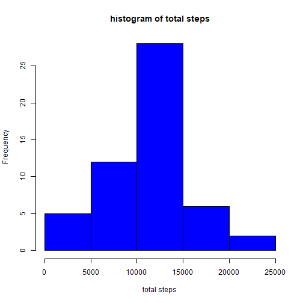
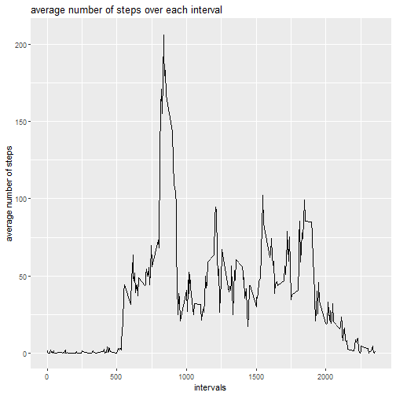
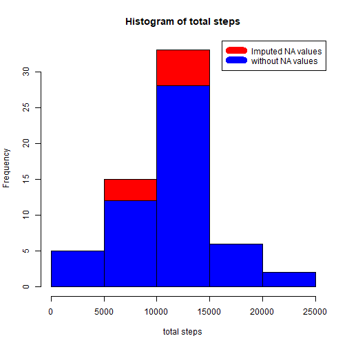
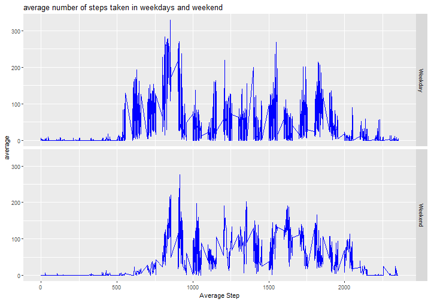

#Coursera project

###reading the data file

```r
maindata<-read.csv("activity.csv")
```

###Question:What is mean total number of steps taken per day?

calculating the total number of steps per day

```r
totalsteps<-tapply(maindata$steps,maindata$date,sum)
```

calculating mean of the total number of steps taken per day

```r
meansteps<-mean(totalsteps,na.rm = T)
```
calculating the median for total number steps taken per day

```r
mdnsteps<-median(totalsteps,na.rm=T)
```
###RESULT: The mean is 10766.18 and median is 10765 of the total number of steps taken per day

creating the histogram

```r
hist(totalsteps,col = "blue",xlab = "total steps",main = "histogram of total steps")
```



##Question:What is the average daily activity pattern?

###calculating average of steps for each interval
1.for this purpose we will split the data by intervals using plyr package
####using plyr package

```r
library(plyr)
library(ggplot2)
```
2. removing the NA containing rows

```r
newdata<-maindata[complete.cases(maindata),]
```
3.using the ddply function

```r
avgsteps<-ddply(newdata,.(interval),summarize,average=mean(steps))
```

4.plotting for intervals and the avg number of steps

```r
ggplot(avgsteps,aes(interval,average))+geom_line()+labs(title="average number of steps over each interval")+labs(x="intervals",y="average number of steps")
```




```r
maxinterval<-avgsteps$interval[which.max(avgsteps$average)]
```
###RESULT:Max average steps is taken in 835 interval.

##Question:Imputing missing values
####adding day variable to maindata

```r
maindata$weekday<-weekdays(as.Date(as.character(maindata$date)))
```

1.calculating the missing values

```r
missingval<-sum(is.na(maindata))
```
####filling the missing values
1.first we will take the data without na.

```r
newdata<-maindata[complete.cases(maindata),]
```
2.adding day variable to newdata

```r
newdata$weekday<-weekdays(as.Date(as.character(newdata$date)))
```
3.To fill the missing values we will take the average of each five minute interval for that weekday.

```r
library(plyr)
```

```r
averageinterval<-ddply(newdata, .(interval,weekday),summarize,average=mean(steps))
```
4.merging the averageinterval with maindata

```r
merged<-merge(maindata,averageinterval,by=c("interval","weekday"))
```
5.missing NA values

```r
navalues<-subset(merged,is.na(steps))
```
6.creating the newdata frame and giving new col names

```r
newdataframe<-data.frame(navalues$average,navalues$date,navalues$interval,navalues$weekday)
colnames(newdataframe)<-c("steps","date","interval","weekday")
```
7.creating the data frame with na values filled in

```r
finaldata<-rbind(newdata,newdataframe)
```
8.calculating the sum of the steps

```r
totalstep<-tapply(finaldata$steps, finaldata$date, sum)
```
9.plotting the histogram


```r
hist(totalstep,col = "red",xlab="total steps",main = "Histogram of total steps")
hist(totalsteps,col = "blue",add=TRUE)
legend("topright", c("Imputed NA values","without NA values"),col = c("red","blue"),lty =c(1,1),lwd = c(10,10) )
```



10.calculating the mean and median

```r
newmean<-mean(totalstep)
newmedian<-median(totalstep)
print(newmean)
```

```
## [1] 10821.21
```

```r
print(newmedian)
```

```
## [1] 11015
```
###RESULT:
#####Yes, the mean and median of imputed na values are differ from the mean and median of without na values
#####mean and median of without na values is 10766.18 and 10765

#####mean and median of imputed na values is 10821.21 and 11015.10 

#####The impact of imputed na values is that the total number of steps between 5000 to 15000 has increasd.

##Question:Are there differences in activity patterns between weekdays and weekends?
###taking average across all weekdays and weekends

```r
library(plyr)
library(ggplot2)
weekd<-ddply(finaldata, .(interval,weekday),summarize,average=mean(steps))
catagory<-ifelse(weekd$weekday%in%c("Saturday","Sunday"),"Weekend","Weekday")
weekd$catagory<-catagory
```

####plotting the panels for weekdays and weekends

```r
ggplot(weekd,aes(interval,average))+facet_grid(catagory~.)+geom_line(col="blue")+labs(x="Average Step")+labs(title="average number of steps taken in weekdays and weekend")
```


