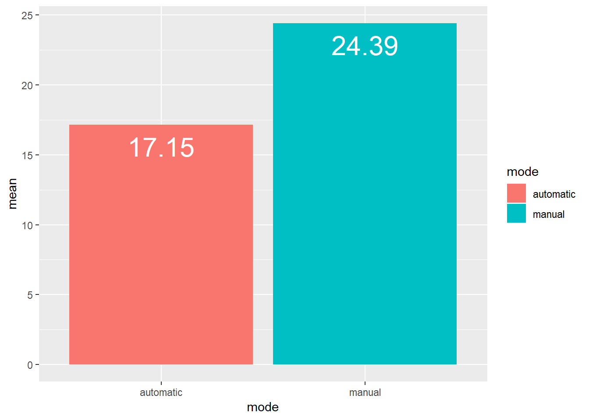
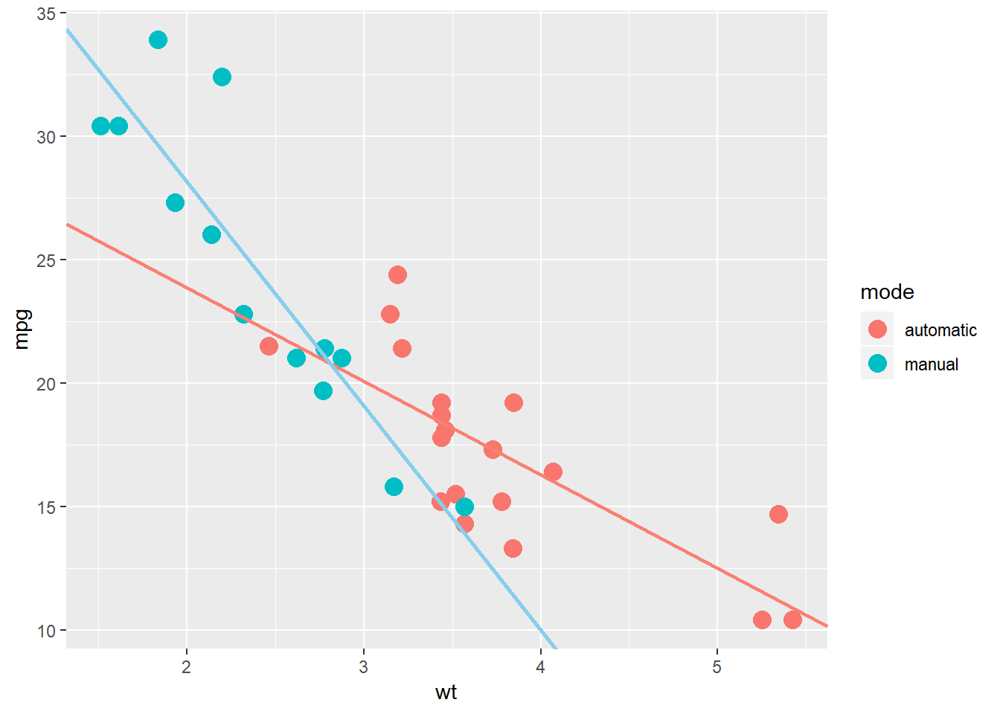
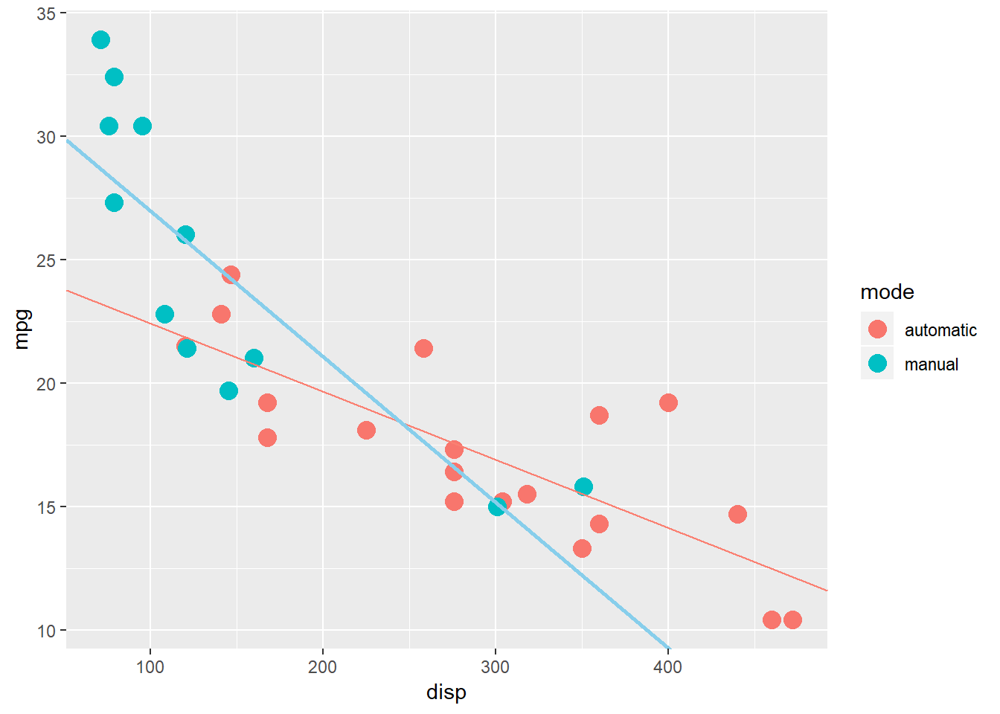
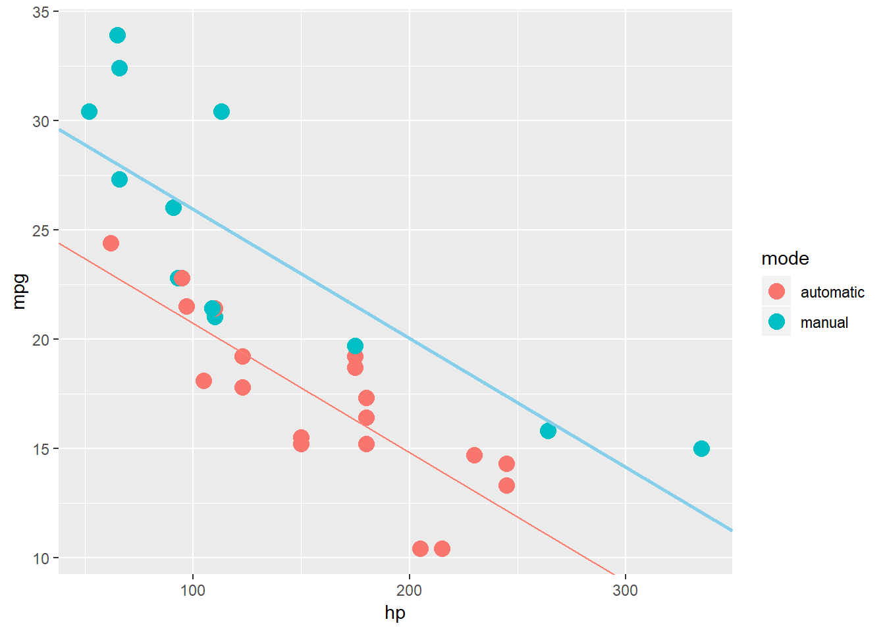
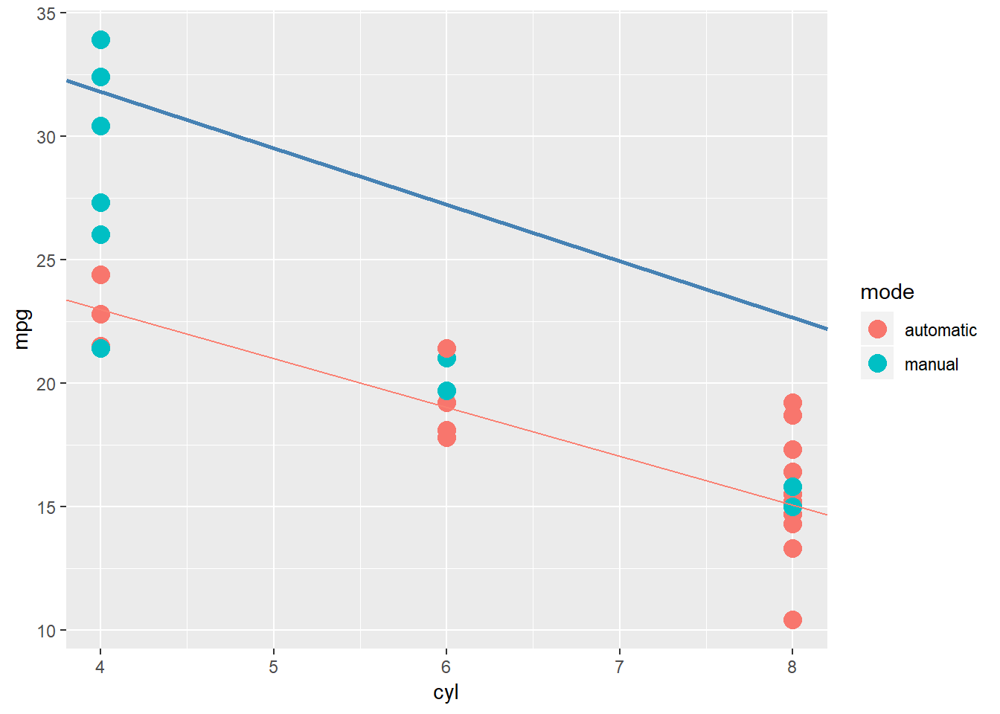
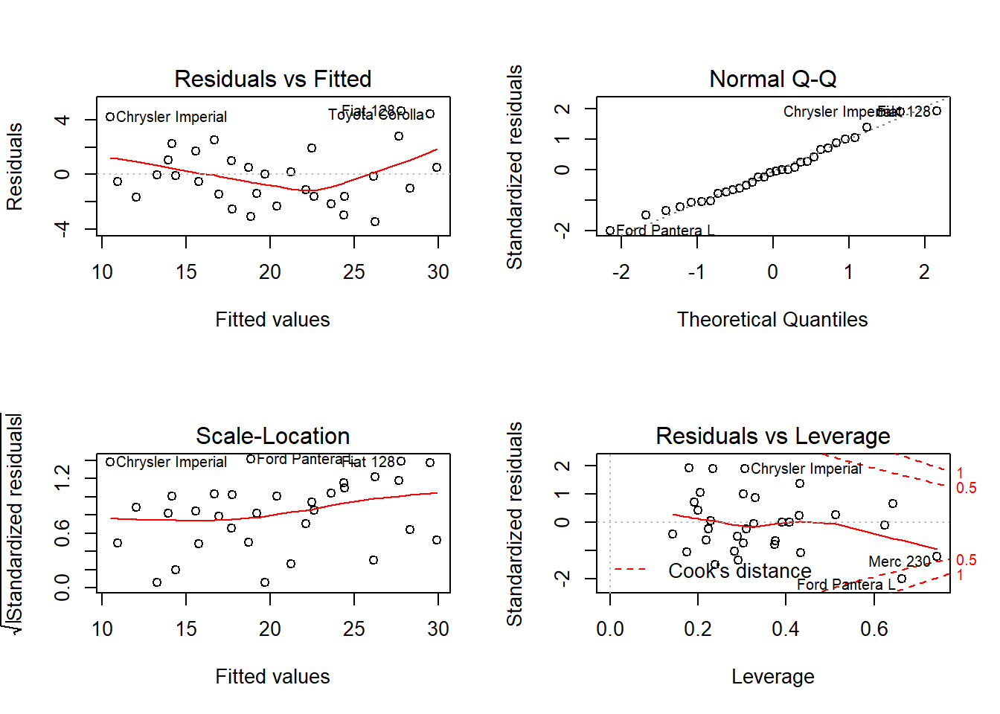

---

title: "Fuel efficiency analysis"
author: "Saurabh Yadav"

---

###Lading the data

```r
data(mtcars)
library(ggplot2)
```

```
## Warning: package 'ggplot2' was built under R version 3.5.1
```

```r
library(dplyr)
```

```
## 
## Attaching package: 'dplyr'
```

```
## The following objects are masked from 'package:stats':
## 
##     filter, lag
```

```
## The following objects are masked from 'package:base':
## 
##     intersect, setdiff, setequal, union
```
#### Adding a colomun to identify the auto and manual transmission.

```r
mtcars$mode<-ifelse(mtcars$am==0,"automatic","manual")
```
#Executive summary
####In this we assume that we work for a motor trend magazine and we have to look at the dataset of the mtcars and explore the relationship between the few variables and the mpg variable. In this we have to specially give the answers for the following questions
####1."Is an automatic or manual transmission better for MPG"
####2."Quantify the MPG difference between automatic and manual transmissions"

##Exploratory analysis

####1. First taking the simply mean of the mpg of transmissions


```r
sumry<-group_by(mtcars,mode)
meandata<-summarise(sumry,mean(mpg))
meandata<-data.frame(meandata)
colnames(meandata)<-c("mode","mean")
```


### Conclusion from the exploratory analysis

###1. By taking the mean we can analyse that the manual transmission is better that the automatic. But to be sure we have to do some regression analysis to check if the manual is always better or it depends on some factors of the data.

#Regerssion analysis

##Fitting the different models

###1.Fitting the model considering all the variables

```r
fit1<-lm(mpg~.,data = mtcars)
fit1
```

```
## 
## Call:
## lm(formula = mpg ~ ., data = mtcars)
## 
## Coefficients:
## (Intercept)          cyl         disp           hp         drat  
##    12.30337     -0.11144      0.01334     -0.02148      0.78711  
##          wt         qsec           vs           am         gear  
##    -3.71530      0.82104      0.31776      2.52023      0.65541  
##        carb   modemanual  
##    -0.19942           NA
```

####Conclusion: The model including all the variables does not show a good estimation for transmission. So we are including the differnt variables with interaction factor am(0=automatic,1=manual).

###2. Fitting the model considering the wt variable


```r
fit2<-lm(mpg~wt*factor(mode),data = mtcars)
fit2$coefficients
```

```
##           (Intercept)                    wt    factor(mode)manual 
##             31.416055             -3.785908             14.878423 
## wt:factor(mode)manual 
##             -5.298360
```
### Conclusion:
####1. For automatic transmission the intercept is 31.4161 and for every 1000 lbs increase there is 3.7859 mpg decrease. 
####2. For manual transmission the intercept is 46.28 an for for every 1000 lbs increase there is 9.07 mpg decrease  mpg.
####3. But according to Plot 2 in the appendix the manual transmission is better for the light weight cars.

###3. Fitting the model considering the disp variable


```r
fit3<-lm(mpg~disp*factor(mode),data = mtcars)
fit3$coefficients
```

```
##             (Intercept)                    disp      factor(mode)manual 
##             25.15706407             -0.02758360              7.70907298 
## disp:factor(mode)manual 
##             -0.03145482
```

###Conclusion:

####1. The intercept is 25.1570 for automatic transmission and for increase in displacement the decrease in  mpg is 0.027584 and for manual transmission the intercept is 32.85 and for each increase in mpg the decrease is 0.059039. 

####2. But according to the plot 3 in appendix the manual transmission gives higher mpg for the displacement less than 245 (cu.in.)

###4. Fitting the model considering the hp variable


```r
fit4<-lm(mpg~hp*factor(mode),data = mtcars)
fit4$coefficients
```

```
##           (Intercept)                    hp    factor(mode)manual 
##         26.6248478696         -0.0591369818          5.2176533777 
## hp:factor(mode)manual 
##          0.0004028907
```

###Conclusion: 

####1. For automatic transmission the intercept is 26.62 and for each increase in horsepower there is 0.0591 decrease in mpg.

####2. For manual transmission the intercept is 31.83 and for each increase in horsepower there is .058 decrease in mpg.

####3. and accordin to the plot 4 the mannual transmission is better when we include the hp variable.


###3. Fitting the model considering the cyl variable

```r
fit5<-lm(mpg~cyl*factor(mode),data = mtcars)
fit5$coefficients
```

```
##            (Intercept)                    cyl     factor(mode)manual 
##              30.873529              -1.975735              10.175407 
## cyl:factor(mode)manual 
##              -1.305116
```

###Conclusion: For auto transmission there is 1.9757 decrease in mpg when cylinder increases and manual transmission there is 2.28 decrease in mpg when cylinder increases. But according to the plot 5 the manual transmission is better.


#Apendix


##Plot 1 (exploratory analysis)

```r
ggplot(meandata,aes(x=mode,y=mean))+geom_bar(stat = "identity",aes(fill=mode))+geom_text(aes(label=round(mean,2)), vjust=1.6, color="white", size=8)
```




##Plot 2 (fitting the model with variable wt)

```r
ggplot(data = mtcars,aes(x=wt,y=mpg,color=mode))+geom_point(size=4)+geom_abline(slope = -3.786,intercept = 31.416,color="salmon",size=1)+geom_abline(slope = -9.08,intercept = 46.28,color="skyblue",size=1)
```




##Plot 3 (fitting the model with variable disp)

```r
ggplot(data = mtcars,aes(x=disp,y=mpg,color=mode))+geom_point(size=4)+geom_abline(slope = -0.027584,intercept =25.157,color="salmon")+geom_abline(slope = -0.0590,intercept = 32.85,color="skyblue",size=1)
```




##Plot 4 (fitting the model with variable hp)

```r
ggplot(data = mtcars,aes(x=hp,y=mpg,color=mode))+geom_point(size=4)+geom_abline(slope = -0.05913,intercept =26.624,color="salmon")+geom_abline(slope = -0.0590,intercept = 31.83,color="skyblue",size=1)
```




##plot5 (fitting the model with variable cyl)


```r
ggplot(data = mtcars,aes(x=cyl,y=mpg,color=mode))+geom_point(size=4)+geom_abline(slope = -1.9757,intercept =30.87,color="salmon")+geom_abline(slope = -2.2808,intercept = 40.9,color="steelblue",size=1)
```




##Plot 6 (Residuals and diagnostics)

```r
par(mfrow = c(2, 2))
plot(fit1)
```


